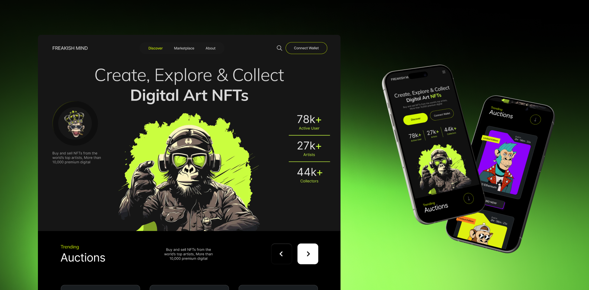

# Freakish Mind — NFT Marketplace Concept

A sleek, minimal yet vibrant **NFT Marketplace Frontend** concept — designed and built entirely using **HTML** and **CSS**.  
Inspired by futuristic digital art platforms, this project focuses on **visual hierarchy**, **color contrast**, and **pixel-perfect layout**.

---

## Preview

---

## Live Demo

**[View Project Here →](https://prashantww.github.io/NFT-frontend/)**

---

## Built With

- **HTML5** – clean and semantic structure
- **CSS3** – advanced layout and hover effects
- **Flexbox & Grid** – responsive and balanced sections

---

## Contact

If you’d like to connect or discuss a project, reach me here:

- **Twitter:** [@prashant_kvian](https://x.com/prashant_kvian)
- **Email:** prashant1warghude@gmail.com
